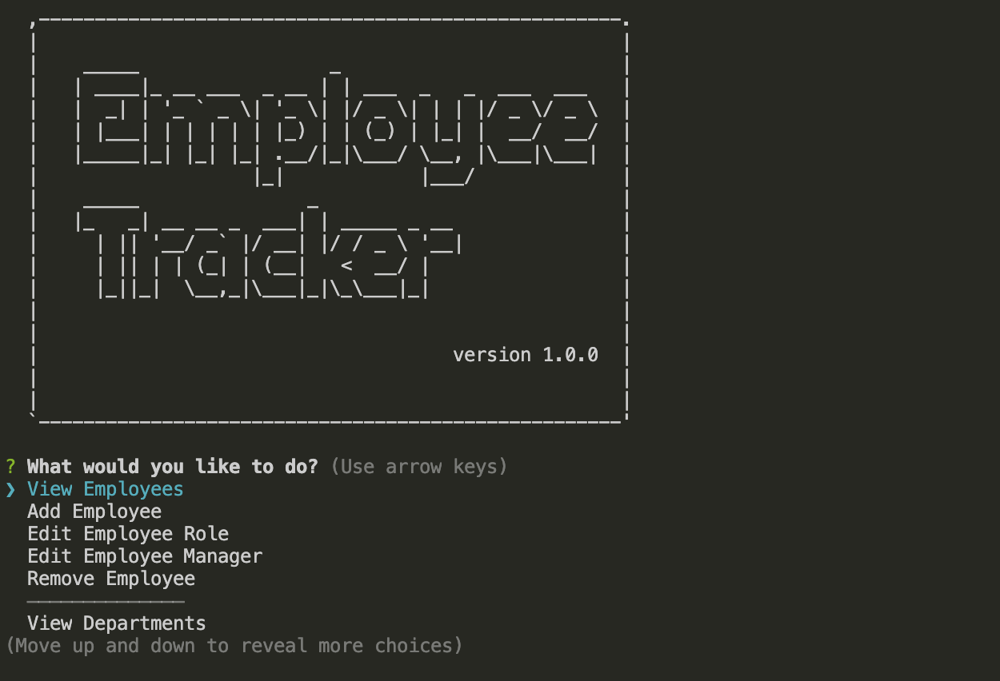

# Employee Tracker

Developers are often tasked with creating interfaces that make it easy for non-developers to view and interact with information stored in databases. Often these interfaces are known as **C**ontent **M**anagement **S**ystems. Employee Tracker is a CLI for managing employee's using node, Inquirer, and MySQL.

## Getting Started

In order to run Employee tracker, you will need to populate your database using the schema included with this project. You will also need to npm install all your dependencies.

## Testing
There are currently no tests set up for this project.

## Built With
* [Inquirer](https://www.npmjs.com/package/inquirer) - CLI tool
* [Node](https://nodejs.org/) - Package Manager
* [MySQL](https://www.mysql.com/) - Database

## Authors

* **Andrew Freire** 

## License

This project is licensed under the MIT license

